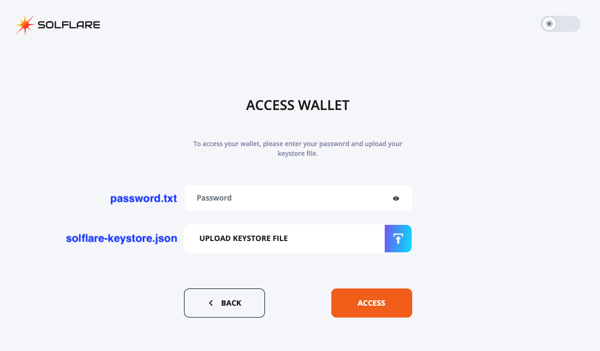
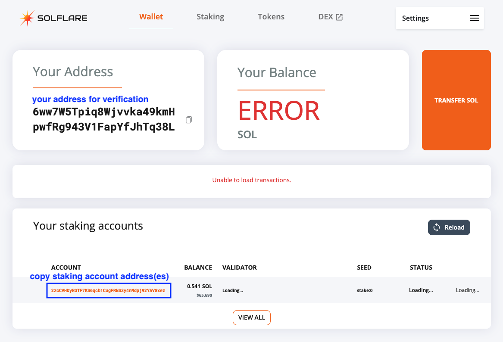

# Solflare Wallet Recovery Tool

A comprehensive command-line tool for recovering and managing legacy Solflare wallet keystores, including stake account withdrawals and fund transfers.

## Overview

This tool helps you recover access to legacy Solflare wallets by decrypting keystore files and provides an interactive interface for managing your funds, including:
- Decrypting Solflare keystore files
- Verifying wallet access and balances
- Managing multiple stake accounts
- Withdrawing staked SOL
- Transferring funds to new addresses

## Prerequisites

- Node.js v14.0.0 or higher
- A Solflare keystore file (`solflare-keystore.json`)
- Your wallet password saved in a text file (`password.txt`)

## Installation

1. Clone this repository:
```bash
git clone https://github.com/thijmau/solflare-wallet-recovery.git
cd solflare-wallet-recovery
```

2. Install dependencies:
```bash
npm install
```

## Getting Your Keystore and Password

To use this recovery tool, you'll need two files from your Solflare wallet:

> **See example files in `docs/` directory:**
> - `docs/solflare-keystore.example.json` - Example keystore structure
> - `docs/password.example.txt` - Example password format

### 1. Keystore File and Password

Access your legacy Solflare wallet at [https://legacy.solflare.com](https://legacy.solflare.com)

When accessing your legacy Solflare wallet, you'll see a screen like this:



**Place these files in the project root directory (same folder as `script.js`):**

1. Save your **password** to a file named `password.txt` in the project root
2. Download/save your **keystore file** as `solflare-keystore.json` in the project root

**File structure should look like:**
```
solflare-wallet-recovery/
├── script.js
├── solflare-keystore.json  ← Your keystore file here
├── password.txt             ← Your password file here
├── lib/
└── ...
```

> **Note:** You can name these files differently or place them elsewhere, but you'll need to provide the correct paths when the script prompts you for the file locations.

### 2. Finding Your Addresses

Once you access your wallet, you can find important information:



- **Wallet Address**: Copy this for verification (shown under "Your Address")
- **Staking Account Addresses**: Copy these from the "Your staking accounts" section if you have staked SOL

## Usage

**Make sure you're in the project root directory** (where `script.js` is located), then run:

```bash
npm start
```

Or directly:

```bash
node script.js
```

The tool will look for `solflare-keystore.json` and `password.txt` in the current directory by default.

### Interactive Steps

The tool will guide you through the following steps:

#### Step 1: File Input
- Enter paths to your keystore and password files (or use defaults)
- Files are validated before proceeding

#### Step 2: Keystore Decryption
- Your keystore is decrypted using the Solflare decryption method
- The recovered keypair is verified and saved to `wallet-keypair.json`

#### Step 3: Solana Connection
- Connect to Solana mainnet (or specify a custom RPC URL)

#### Step 4: Balance Check
- View your wallet balance and address

#### Step 5: Stake Accounts
- Manually enter stake account addresses
- View balances for each stake account
- See total balances (wallet + stakes)

#### Step 6: Stake Withdrawal
- Optionally withdraw funds from stake accounts
- Choose destination address (defaults to your wallet)
- Transactions are processed with error handling

#### Step 7: Final Transfer
- Optionally transfer all funds to another address
- Fee is automatically calculated and reserved

## Security Notes

⚠️ **Important Security Considerations:**

- This tool handles sensitive cryptographic material (private keys)
- Always verify you're using the official repository
- Never share your keystore file or password
- The recovered `wallet-keypair.json` contains your private key - keep it secure
- Review all transaction details before confirming
- Consider testing with a small amount first

## Troubleshooting

Having issues? See [TROUBLESHOOTING.md](TROUBLESHOOTING.md) for common problems and solutions.

## Disclaimer

This software is provided "as is", without warranty of any kind. Use at your own risk. Always verify transactions before confirming them. The authors are not responsible for any loss of funds.

## Support This Project

If this tool helped you recover your funds, consider supporting the development:

- **Bitcoin (BTC)**: `bc1qj24nen3z3en5n89eqg3dsh37cgjytmdqjsehq5`
- **Ethereum (ETH)**: `0xd4e249a6aeda20e318922ea448992df26d23bc3d`
- **Solana (SOL)**: `9cz2vBNaS9ZKnXzyLM1D7HjF1p9gwH4mYXamDpRg3UWN`

Tips are appreciated but never required. This tool is free and open source.

## Support

If you encounter any issues or have questions:
- Open an issue on [GitHub](https://github.com/thijmau/solflare-wallet-recovery/issues)
- Ensure you never share your private keys or keystore files when seeking help
